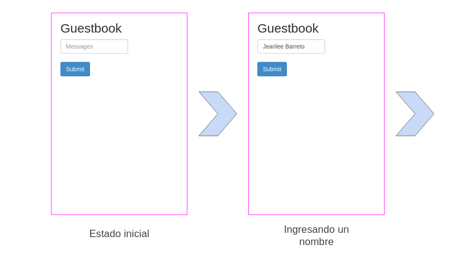
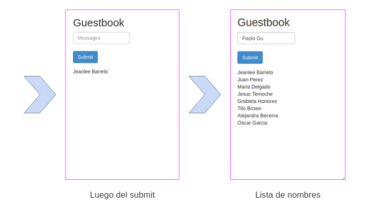

# Tarea 2 - Containerized application

Para este trabajo vamos a utilizar una aplicación contenerizada y desplegarla en un clúster local Kubernetes uni-nodo y también en uno multinodo. Para esto emplearemos las herramientas minikube y kubectl.

## **Aplicación seleccionada**

La aplicación que se pudo encontrar no presenta una funcionalidad muy compleja. Sin embargo, pese a su simpleza de cara al usuario, la implementación que tiene por detrás nos ayuda a conocer mejor el uso del Kubernetes en una aplicación con distintos niveles.

Se seleccionó una aplicación que sirve como un libro de visitas (guestbook) que forma parte de los casos ejemplo que brinda Kubernetes. El uso directo de esta aplicación se da en escenarios donde se necesita tener un registro de las personas que están ingresando a un determinado espacio o evento.

Puede tratarse de una fiesta, un evento privado, un domicilio, un centro custodiado, entre otros escenarios.

## **Uso de la aplicación como usuario**

Como se mencionó anteriormente, el uso es muy sencillo de cara al usuario. Solo se necesita llenar un campo de entrada donde se va a escribir el nombre de la persona a registrar. Una vez llenado el campo solo se da un clic en el botón Submit y el nombre queda grabado en una lista de personas.

A continuación se presenta un pequeño flujo de la aplicación:

## **Tecnologías presentes en la aplicación**

La aplicación se puede dividir en dos nivel, uno centrado en la interfaz de usuario (frontend) y el otro centrado en el proceso y almacenamiento de datos (backend).

### **Frontend**

En el frontend se utiliza el framework **Angular.js** (a través de su CDN) con la finalidad de que el usuario pueda interactuar con la interfaz web. Angular también nos ayuda a poder capturar los datos que ingresa el usuario en el input de texto y a manejar el botón de submit.

Así mismo, se tiene un pequeño script en **PHP** que nos permite conectarnos con la base de datos para obtener y colocar los nombres del libro de visitas. Normalmente, en un entorno de desarrollo regular este comportamiento PHP va en el backend, sin embargo, en esta aplicación decidieron ponerlo en el Frontend. Una explicación para esto puede ser porque en este contexto el backend se está centrando únicamente en la base de datos.

### **Backend**

Aquí se emplea **Redis** como gestor de base de datos. Como se mencionó anteriormente, los autores decidieron colocar solo la base de datos en este nivel. Otra explicación para este decisión es que están empleando una división de jerarquía del tipo líder-seguidor para almacenar los datos. Este es un punto interesante ya que, cómo veremos en la siguiente sección, esta jerarquía nos permitirá escalar la base de datos de una manera sencilla.

Algo a tener en cuenta es que Redis es conocido por ser un gestor de Base de Datos centrado en la memoria. Esto quiere decir que no guarda los datos en un disco duro como se hace regularmente. Con esta característica, según el mismo Redis, se obtienen y guardan datos de una forma más rápida y flexible. Es algo muy interesante, pero para nosotros esta característica implica que no necesitaremos adjuntar un volumen al momento de desplegar nuestra base de datos.

## Referencia de la aplicación

El sitio de donde se obtuvo la aplicación es de los ejemplos que brinda Kubernetes. El enlace es el siguiente [Deploying PHP Guestbook application with Redis](https://kubernetes.io/docs/tutorials/stateless-application/guestbook/)