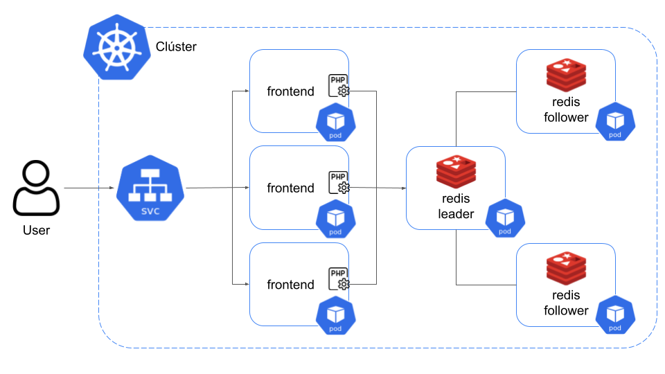
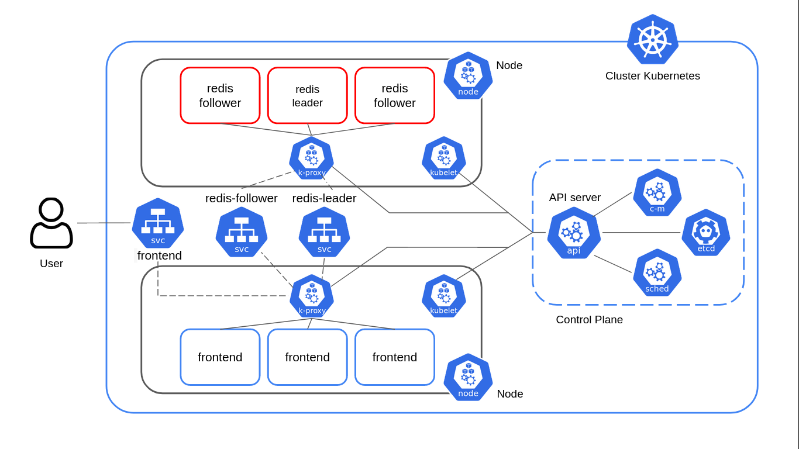

# Diagramas de Flujo

Los diagramas de flujo nos ayudan a entender de una manera visual, y muchas veces más intuitiva, cómo funciona un determinado proceso. En nuestro caso, vamos a presentar los diagramas correspondientes al funcionamiento de la aplicación *Libro de Visitas* deployada en Kubernetes.

## Flujo de alto nivel

## Flujo de bajo nivel

